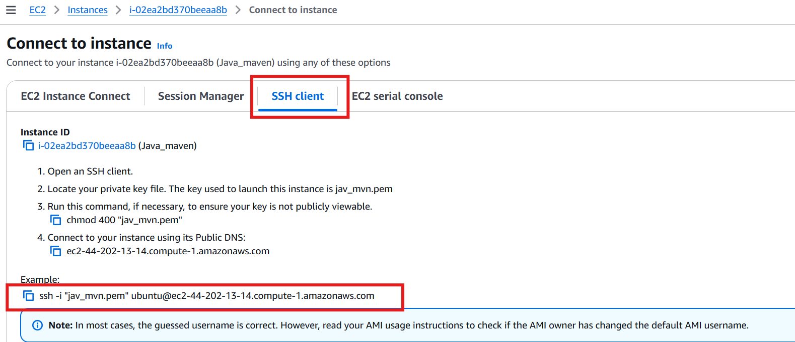

📄 Java-Based Code Build & Deployment Using Ec2, Maven, And Tomcat
====================================================================
🧩 Overview:
This guide walks you through setting up an EC2 instance, building a Java project using Maven, and deploying the final .war artifact using Apache Tomcat.

✅ Step 1: Launch EC2 Instance
-------------------------------
Go to AWS Management Console and launch an EC2 instance:

Operating System: Ubuntu (latest stable version)

Instance Type: t2.micro or t3.micro (Free Tier eligible)

Security Group Rules:

SSH – Port 22 (for remote access)

Custom TCP – Port 8080 (for Tomcat access)

Launch the instance and note the Public IP address.

✅ Step 2: Connect to the EC2 Instance & Setup Environment
----------------------------------------------------------
Connect using SSH:

ssh -i <your-key.pem> ubuntu@<your-ec2-public-ip>
Switch to root user:

sudo -i
Update the packages:

apt update
Install Java (version compatible with your app, e.g., OpenJDK 11):

apt install openjdk-11-jdk -y
Install Maven:

apt install maven -y

✅ Step 3: Build the Java Project using Maven
----------------------------------------------
Clone the project repository:

git clone <repository-URL>
cd <project-directory>
Make sure the pom.xml file exists and includes necessary dependencies and plugins.

Run the Maven build commands:

mvn validate
mvn compile
mvn test
mvn package
After a successful build, a target/ folder will be generated containing the .war file (artifact).

✅ Step 4: Install and Configure Apache Tomcat
-----------------------------------------------
Download Apache Tomcat:

wget https://downloads.apache.org/tomcat/tomcat-9/v9.x.xx/bin/apache-tomcat-9.x.xx.tar.gz
Extract the tar file:

tar -xvzf apache-tomcat-9.x.xx.tar.gz
cd apache-tomcat-9.x.xx
Start Tomcat:

cd bin
./startup.sh
Access Tomcat in the browser:

URL: http://<ec2-public-ip>:8080

You will see the Tomcat GUI.

✅ Step 5: Enable Tomcat Manager Access
----------------------------------------
Edit tomcat-users.xml to create a manager user:

vi conf/tomcat-users.xml
Add below lines before /tomcat-users:

<role rolename="manager-gui"/>
<user username="admin" password="admin" roles="manager-gui"/>

Modify access restrictions:

Edit webapps/manager/META-INF/context.xml:

vi webapps/manager/META-INF/context.xml
Comment or remove the following lines:

<!--
Valve className="org.apache.catalina.valves.RemoteAddrValve"
       allow="127\.\d+\.\d+\.\d+|::1" />
-->
Repeat for webapps/host-manager/META-INF/context.xml.

✅ Step 6: Deploy .war File
----------------------------
Copy the .war file from the target folder to Tomcat's webapps directory:

cp /path/to/your/project/target/*.war /path/to/tomcat/webapps/
Restart Tomcat:

./shutdown.sh
./startup.sh

Access the deployed application:

  http://<ec2-public-ip>:8080/<your-app-name>

  

✅ Final Notes
Ensure your .war file name doesn't conflict with existing Tomcat apps.

You can monitor deployment via the Tomcat Manager GUI.

Consider securing the Tomcat Manager with strong credentials or IP restrictions for production.

